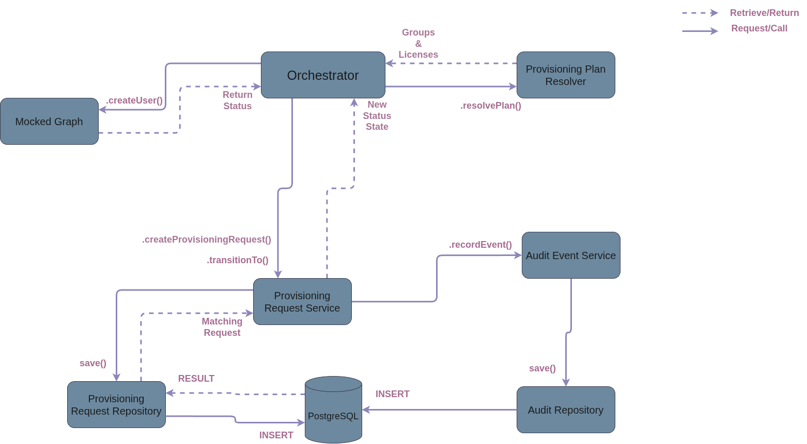

# How the system is built

## Purpose

The responsibility of this platform is to automate employee identity provisioning by validating onboarding requests, applying business rules, provisioning identities, and recording provisioning states. The platform is designed to be scalable, maintainable, and resilient while providing auditing and error handling.

#### The platform is not responsible for:

- Managing HR employee records
- Replacing Microsoft Entra ID
- Managing employee lifecycle outside provisioning

---

## System Context

### This application interacts with:

- HR Information System
- Microsoft Graph
- PostgreSQL

---

## High-Level Architecture

### Scope
The model illustrates the interaction between the identity platform and externals.

### Key Interactions
- HR/Caller interacts with the platform's endpoints.
- PostgreSQL stores the platform's internals.
- Microsoft Graph receives the platform's requests.

---

## Provisioning Lifecycle

### Scope
This diagram illustrates the lifecycle of the platform's onboarding process. 

### Key Interactions
- HR/Caller requests an action or a response from the controller.
- PostgreSQL stores persistent entities and responses.
- The business logic lives within each service's responsibility.
- The mocked graph simulates exceptions and communicates to the orchestrator.
- The controller contains employee endpoints and triggers the orchestrator.
- The orchestrator wires the mocked graph and services together to complete the platform's lifecycle.

---

### Understanding Employee Creation

### Scope
The controller receives a POST request by the caller - here we understand the process of employee creation.

### Key Interactions
- HR/Caller sends a POST create employee request to the controller.
- The Controller calls EmployeeService, IdempotencyRecord, and the Orchestrator to begin employee creation.
- EmployeeService creates a persistent employee using HR/Caller information into postgreSQL database.
- IdempotencyRecord checks if the employee already exists using an idempotency key.
- The Orchestrator is triggered to start provisioning only if the employee does not contain a matching idempotency key in the database. 
- The Controller sends back an employee response to HR/Caller containing contents on date of creation.

---

### Provisioning Orchestration

### Scope
Here illustrates how the orchestrator coordinates with other services.

### Key Interactions
- The Orchestrator sends a create provisioning request to the service. 
- ProvisioningRequestService creates a persistent request and sets its status as RECEIVED.
- AuditEventService records a persistent event for each new request or state transition - this includes exceptions throughout the lifecycle.
- ProvisioningPlanResolver returns groups & licenses associated with the employee's department. 
- The Mocked Graph simulates failure exceptions
- The Orchestrator requests a final state transition to complete the provisioning lifecycle.

---

